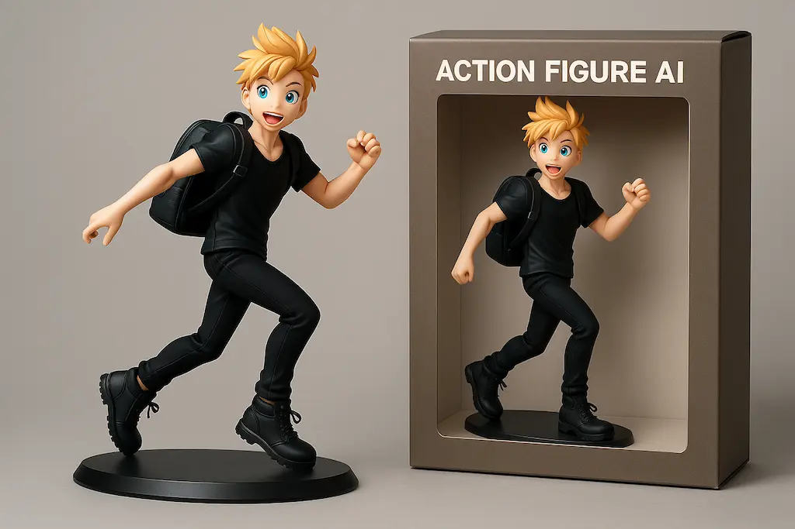
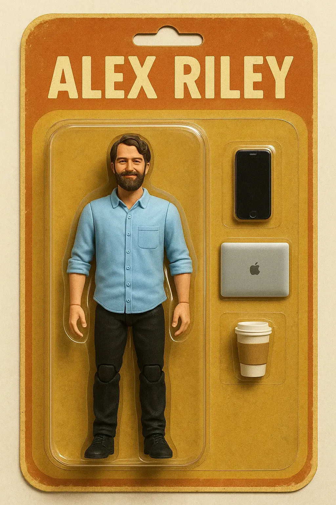
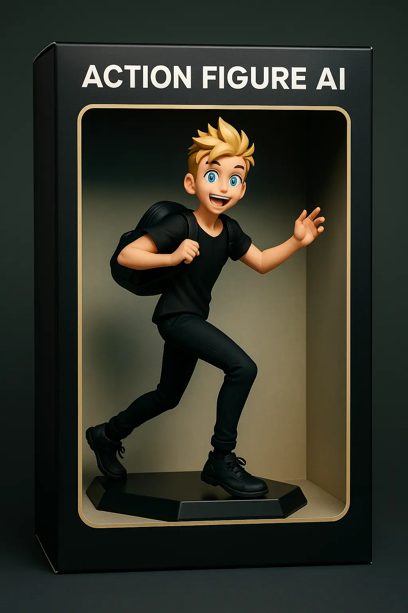
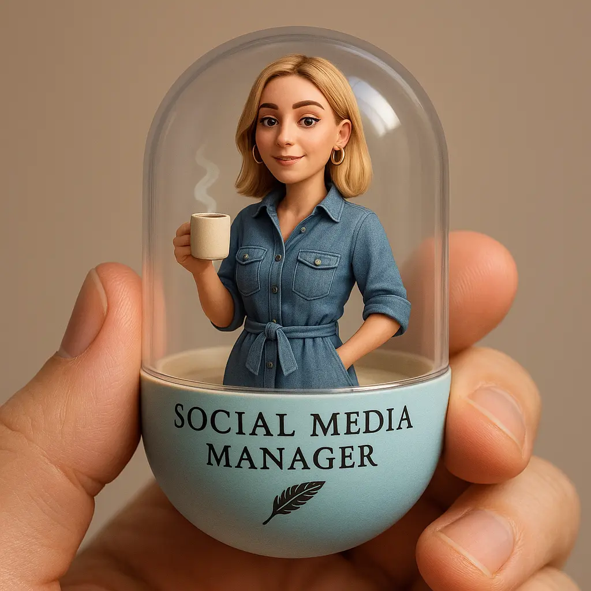
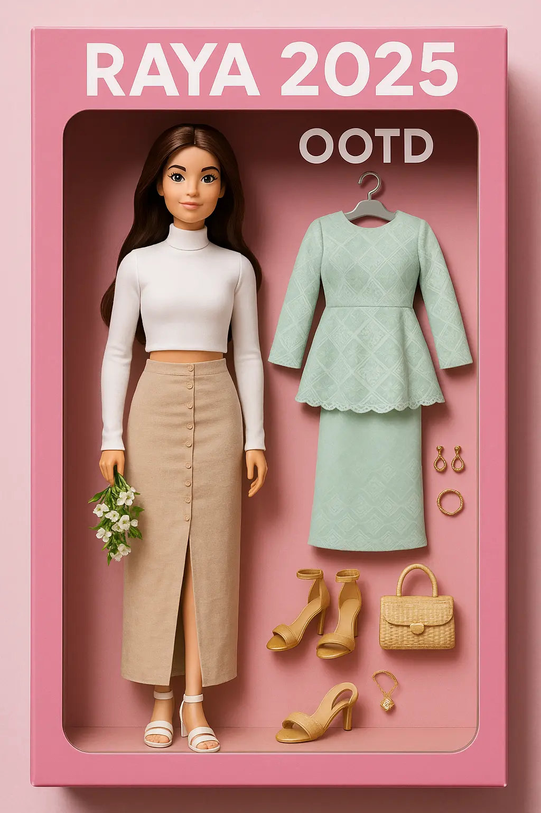
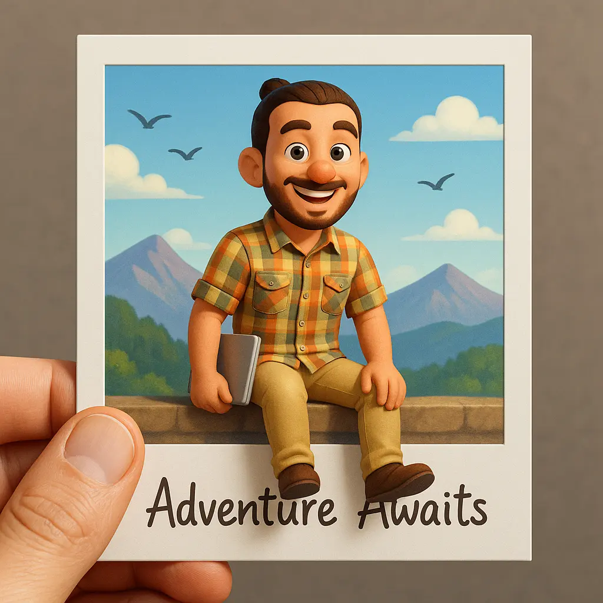
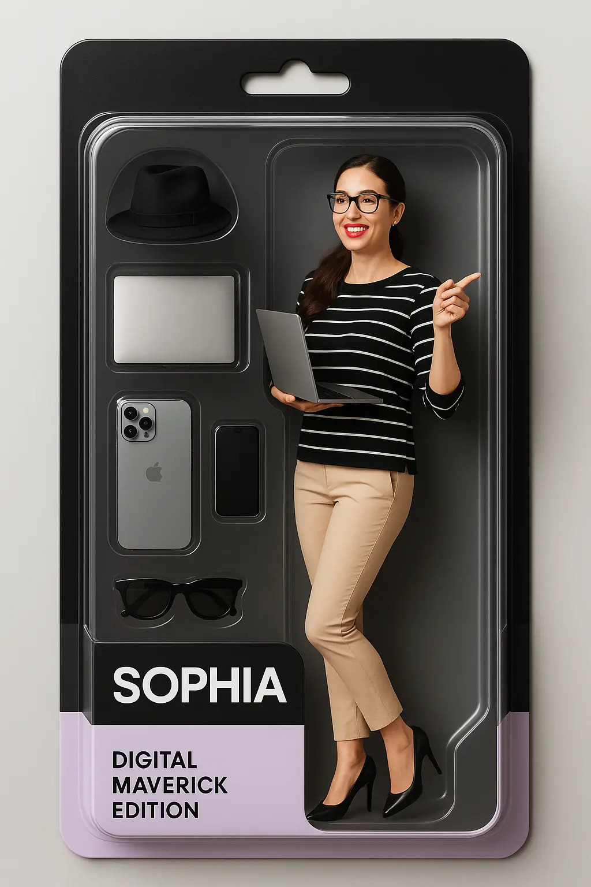
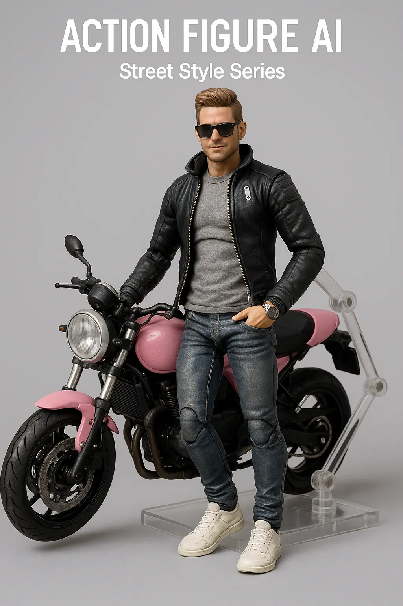

# Action Figure AI - Inspiration Gallery

Explore stunning AI action figure creations and get inspired to create your own personalized figure using the Action Figure AI generator!

## Examples

Here are some examples of what you can create:

---

### 1. 3D Figure

**Style:** 3D Figure

**Prompt:**

Create a high-quality, anime-style action figure of person using my attached photo as a reference, a dynamic pose on a black display base. The character's outfit is detailed base on the original image. Next to the figure is a professionally designed retail box featuring matching character artwork and stylized branding, on top of the box writed "Action Figure AI".

---

### 2. Male Programmer

**Style:** Toy Figure

**Prompt:**

a plastic action figure with articulating limbs based on the person in this photo. show the full figure inside a vintage blister-pack packaging. next to the action figure, show accessories.

- at the top of the packaging, display the name: "Alex Riley"
- inside the packaging, include accessories: iphone, macbook, coffee

---

### 3. Action Figure

**Style:** 3D Figure

**Prompt:**

Create a high-quality, anime-style action figure of the person using my attached photo as a reference. The figure should be posed dynamically on a sleek black display base and placed inside a professionally designed retail box with a clear front window to showcase the figure within. The character’s outfit must be faithfully and intricately recreated based on the original image.

The exterior of the box must not feature any character artwork or images of the figure — keep the design clean, using only stylized branding elements. At the very top edge of the box , clearly display the title "Action Figure AI" on a single line only — do not allow the text to wrap or split.

Focus on realistic lighting, high-quality render details, and a premium collector’s aesthetic. The figure should be visibly housed inside the box, as it would appear in a retail setting.

---

### 4. Capsule Girl

**Style:** Toy Figure

**Prompt:**

Generate a portrait ratio photo of a detailed gashapon capsule held between two fingers. Inside the capsule is a miniature version of (a young woman named Chloe - photo attached), dressed in a (stylish chambray shirt dress), holding a (tiny steaming mug of coffee) in a relaxed pose.

She has (fair skin, soft pink lips, hoop earrings, and The background inside the capsule shows a (minimalist studio backdrop with neutral tones and soft lighting). The capsule is half-transparent, with a (matte pastel blue base), labeled "Social Media Manager" in a serif font, and a (quill feather motif) engraved for creativity. The style is ultra-detailed, Pixar-like proportions, soft shadows, clay-toy realism, and cozy professional aesthetic.

---

### 5. Raya Girl

**Style:** Toy Figure

**Prompt:**

Create a toy of this person in the photo,let it be Barbie doll style.
Next to the figure,there should be accessories equiment (like baju raya, heels, bag and other jewelleries).On top of the box, write "Raya 2025 OOTD".

---

### 6. Polaroid Photo

**Style:** Figure Card

**Prompt:**

Create a stylized 3D character based on my photo reference. The character is sitting on the edge of a Polaroid-style photo frame, with both legs playfully hanging outside the frame. Background: scenic mountains, blue sky, and birds flying. Outfit: as original in the picture. Facial expression: smiling. At the bottom of the Polaroid frame, it says in handwritten script: “Adventure Awaits”. A realistic male or neutral hand is holding the Polaroid photo.

---

### 7. Digital Maverick

**Style:** Toy Figure

**Prompt:**

Create an image of A premium boxed toy action figure of a bold female content creator and tech expert Sophia in (photo as attached), inside a transparent high-end blister package. The box has sleek modern black and pastel tones with clear accessory compartments. Accessories include: [Hat, Foldable laptop, Iphone 16 pro max, Ray-Ban goggles etc], Label: “Sophia - Digital Maverick Edition” Clean, aesthetic studio-style packaging. Soft shadows, ultra-realistic.

---

### 8. Street Style Series

**Style:** Toy Figure

**Prompt:**

Create a realistic action figure myattached photo as a reference for the character, motorcycle, and pose.
The figure must have a high-detail, premium collectible style, not like Figma or SHFiguarts.
The figure must have visible articulation joints.
It must be on a clear articulated base/stand as shown.
Use a plain, simple light grey studio background.
Include white text overlays at the top center: Main title "ACTION FIGURE AI", subtitle below "Street Style Series".

---

## Try It Yourself!

Ready to turn yourself or your friends into awesome action figures?

Visit the [**Action Figure AI Generator**](https://actionfigureai.online) now and start creating!